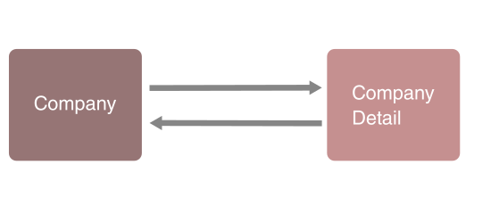

Hibernate, Java and legacy RDBMS databases (a brush up guide)
=============================================================


Let's say that as an updated developer you are you've been very interested lately in NoSQL technologies and that a project using a legacy RDBMS database comes into your hands. In this guide we will review much of the information needed to get out of that situation.


What do I need to understand this guide?
----------------------------------------
- Knowledge of Java
- Knowledge of how to use the Eclipse IDE or Spring Tool Suite
- Knowledge of MariaDB/MySQL
- Knowledge of JPA/Hibernate (POJOs, entities, etc.)


What is Hibernate?
------------------
Hibernate is basically very good at converting objects into expressions that understand relational databases and vice versa. That is, on the one hand we have tables and records when we use a relational database, such as MariaDB, and on the other hand Java objects. 

This process of translating tables to objects and vice versa is called Object-to-Relational Mapping (ORM).


The initial configuration of Hibernate
--------------------------------------

Hibernate does not depend on any particular framework, we could download the necessary files from the project page and use it in any Java project. But it is true that using a framework speeds up and simplifies the setup process. Therefore, for this guide we will create our projects with Springboot Starter with the following features:


We can see that we use DevTools, JPA and MySQLDriver starters. The parameters Artifact and Group we have left them as they come by default.

 
When we use a starter for JPA in Spring Boot, such as spring-boot-starter-data-jpa, the default implementation we'll be using is Hibernate. Hibernate is basically a JPA implementation. 


One detail to remember is that Hibernate is not " innocuous". It offers additional functions in addition to those of JPA. But depending on them means being limited to using Hibernate. Once we make use of these additional functions we cannot go directly to other JPA implementations such as Toplink.


Hibernate consists of three different components:
- Entities: The classes that Hibernate maps from the relational database tables. These classes are POJOs (Plain Old Java Objects).
- Object-relational metadata: The information that is used at runtime to perform the assignment to the data warehouse and back to the Java objects.
- Hibernate Query Language (HQL): When using Hibernate, queries to the database do not have to be made in native SQL, but can be made using the Hibernate query language. As these queries are translated at runtime to the dialect used by the chosen product (Oracle DB, MariaDB, etc.), the queries formulated in HQL are independent of the SQL dialect of a specific provider.

 


Hibernate needs something to know which tables relate to which objects. That's what we mean by mapping. The mappings can be done through Java annotations or through an XML mapping file. 

Each of these methods has advantages and disadvantages, but the annotation method is the most widely used at present. In this guide we will use both.

Initial SetUp MariaDB/MySQL
---------------------------

This section assumes that you have a MariaDB or MySQL database server running on your system and the ability to create databases and tables. Therefore, let's access the server and execute the following queries:

```bash
MariaDB [(none)]> CREATE DATABASE videogames;
MariaDB [(none)]> USE videogames;
MariaDB [(videogames)]> CREATE TABLE gamecharacter(id INT PRIMARY KEY AUTO_INCREMENT, name VARCHAR(45), company VARCHAR(45), year INT);
```

And insert a bunch of records:

```bash
MariaDB [(videogames)]> INSERT INTO gamecharacter(name, company, year) VALUES('Sir Arthur','Capcom', 1985);
MariaDB [(videogames)]> INSERT INTO gamecharacter(name, company, year) VALUES('Mario','Nintendo', 1981);
MariaDB [(videogames)]> INSERT INTO gamecharacter(name, company, year) VALUES('Pac-Man','Namco', 1980);
```

So we have a relational model for the "videogame" database with these features:


We need to tell Hibernate now how to connect to the database. As we have used Springboot Starter for our setup we have in the "resources" directory the "application.properties" file. Let's add our configuration to it:

```bash
spring.datasource.url=jdbc:mysql://localhost:3306/hibernateguide?useSSL=false
spring.datasource.username=user
spring.datasource.password=pass
```

Remember to change the login and password to the corresponding values of your database.


If at this moment we import the project created through Springboot Starter we can proceed to create an object that maps the table we just created. To do this, we write the domain model of our application. In this case are records of video game characters stored in our database on which we want to perform CRUD actions. We create the package "model" (another widely used name for this package could be "domain") and the class" GameCharacter":


The code of the "GameCharacter" class will be as follows:

```java
package com.example.demo.model;

import javax.persistence.Basic;
import javax.persistence.Column;
import javax.persistence.Entity;
import javax.persistence.GeneratedValue;
import javax.persistence.GenerationType;
import javax.persistence.Id;
import javax.persistence.Table;


	
	@Entity
	@Table(name = "gamecharacter")
	public class GameCharacter {

		@Id
		@Column(name = "id")
		@GeneratedValue(strategy = GenerationType.IDENTITY)
	 	@Basic(optional = false)
		private Integer id;
		@Column(name = "name")
		private String name;
		@Column(name = "company")
		private String company;
		@Column(name = "year")
		private Integer year;
		
		public GameCharacter() {
			
		}
		
		public GameCharacter(String name, String company, Integer year) {
			super();
			this.name = name;
			this.company = company;
			this.year = year;
		}

		public Integer getId() {
			return id;
		}

		public void setId(Integer id) {
			this.id = id;
		}

		public String getName() {
			return name;
		}

		public void setName(String name) {
			this.name = name;
		}

		public String getCompany() {
			return company;
		}

		public void setCompany(String company) {
			this.company = company;
		}

		public Integer getYear() {
			return year;
		}

		public void setYear(Integer year) {
			this.year = year;
		}

		@Override
		public String toString() {
			return "GameCharacter [id=" + id + ", name=" + name + ", company=" + company + ", year=" + year + "]";
		}
		

	}
```


We just mapped our "GameCharacter" class with the "gamecharacter" table. Notice that it is a POJO with a couple of builders and their respective setters and getters. The only thing that stands out is the use of annotations. Let's see what this is all about.

 
Basic Mapping and Object Identity
---------------------------------

Hibernate annotations allow you to define maps without the use of XML files. All metadata is inserted into the POJO java file along with the code, which helps the developer to better understand the table structure during development.
 
Did someone say JDBC?
---------------------

Before continuing to see how the annotations and mapping work by Hibernate it is necessary to remember that "internally" Hibernate uses JDBC to interact with the database. To do this it uses "SessionFactory" and "Session" classes. Let's take a look at their features.

SessionFactory
--------------

It reads the Hibernate configuration file and creates the "Session" objects that our application needs. This is called a heavy-weight object and generally your application will only have one that will be reused again and again.


Session
-------

The "Session" class is a wrapper of a JDBC connection to a database. It is the object we will use to perform CRUD operations. It is an object of a very short life, so for any method we'll get a session, use it and discard it. For another method we will get another session, we will use it and it will be discarded. And so on.

Using SessionFactory and Session
--------------------------------

Typically, in a Spring-Boot application, configured using Maven or using Spring-Boot Starter, it would, as usual, do a lot of heavy-lifting for us and we wouldn't need to instantiate "SessionFactory" and "Session" directly. But since our intention is didactic, let's see how to use them. First delete all the contents of the "application.properties" file that we had previously modified and in that same folder create the "hibernate.cfg.xml" file with the following contents:

```bash
<?xml version="1.0" encoding="UTF-8"?>
<!DOCTYPE hibernate-configuration PUBLIC
        "-//Hibernate/Hibernate Configuration DTD 3.0//EN"
        "http://hibernate.org/dtd/hibernate-configuration-3.0.dtd">
<hibernate-configuration>
    <session-factory>
        <property name="hibernate.connection.driver_class">com.mysql.cj.jdbc.Driver</property>
        <property name="hibernate.connection.url">jdbc:mysql://localhost:3306/videogames</property>
        <property name="hibernate.connection.username">user</property>
        <property name="hibernate.connection.password">pass</property>
        <property name="hibernate.connection.pool_size">100</property>
        <property name="hibernate.current_session_context_class">thread</property>
        <property name="hibernate.show_sql">true</property>
        <property name="hibernate.dialect">org.hibernate.dialect.MySQLDialect</property>
    </session-factory>
</hibernate-configuration>
```

Basically we have moved the Hibernate configuration from one file to another. This configuration mode is a bit old-fashioned, but for our purposes we are going to use it. Once again, remember to change the user and password values in order to identify yourself correctly in your database.

Now let's modify the main class of our project, this way:

```java
package com.example.demo;

import org.hibernate.Session;
import org.hibernate.SessionFactory;
import org.hibernate.cfg.Configuration;
import org.springframework.boot.SpringApplication;
import org.springframework.boot.autoconfigure.SpringBootApplication;

import com.example.demo.model.GameCharacter;

@SpringBootApplication
public class DemoApplication {

	public static void main(String[] args) {
		SessionFactory factory = new Configuration().configure("hibernate.cfg.xml").addAnnotatedClass(GameCharacter.class).buildSessionFactory();
		Session session = factory.getCurrentSession();
		
		try {
			
			// use the session object to perform CRUD operations
			
			GameCharacter character = new GameCharacter("Handsome Jack","Gearbox Software",2012);
			session.beginTransaction();
			session.save(character);
			session.getTransaction().commit();
			
		} finally {
			factory.close();
		}
	}

}
```

We can see that we are using the "hibernate.cfg.xml" file to create a "SessionFactory" object and that through it we get a session with which we insert a new record in the database. 

The result will be the following:


Annotations Hibernate
---------------------


We have already indicated that in previous versions of Hibernate all the configuration and mapping of entities to objects was done through XML files. In general it is currently preferable to do it now through Hibernate annotations that implement the JPA standard along with some particulars of Hibernate itself.

The Hibernate annotations are attached to our Maven projects through the inclusion of the "hibernate-core" dependency:

For example:

```bash
<?xml version="1.0"?>
<project xsi:schemaLocation="http://maven.apache.org/POM/4.0.0
http://maven.apache.org/xsd/maven-4.0.0.xsd"
xmlns="http://maven.apache.org/POM/4.0.0"
xmlns:xsi="http://www.w3.org/2001/XMLSchema-instance">
<modelVersion>4.0.0</modelVersion>
...
<dependencies>
<dependency>
	<groupId>org.hibernate</groupId>
	<artifactId>hibernate-core</artifactId>
	<version>[5.0.0,5.9.9]</version>
</dependency>
<dependency>
<groupId>com.h2database</groupId>
<artifactId>h2</artifactId>
...
```

We have seen in the previous section how we have used Hinernate annotations to map our "Gamecharacter" class to our database table. Let's know a little more about these annotations.

@Entity Annotation
------------------
The @Entity annotation in the "GameCharacter" class marks it as an entity bean. A bean is basically a simple Java object with attributes, getters and setters. A bean entity is a light object of data persistence.

@Table Annotation
-----------------
The annotation @Table allows us to indicate the details of the table on which we will perform our CRUD operations. This annotation has several attributes available, but the only one we have needed in our code is the name of the table: "gamecharacter"

@Id Annotation
--------------
Each entity bean needs a primary key, which we annotate in the class through @Id. The primary key can be a unique field or a combination of fields depending on the structure we are going to work with.

@GeneratedValue Annotation
--------------------------
By default, the @Id annotation will automatically determine the most appropriate key generation strategy, but we can choose our own strategy using the @GeneratedValue annotation. We'll come back to that in a moment.

@Column Annotation
------------------
The @Column annotation is used to specify the column details of the table we are mapping.
 
Primary Keys and Hibernate
--------------------------
 
As we said, Hibernate's main function is to map tables into objects. In a table a primary key is used to uniquely identify a record in that table. The value of that primary key cannot be null and is unique within a table. 

Most relational databases that provide SQL access are able to accept tables that do not have a predefined primary key. Hibernate is not so permissive; even if your table has been created without a primary key, Hibernate will require you to specify one. This usually annoys users who are familiar with SQL and databases but not with ORM tools. 


Let's look at the primary keys our "gamecharacter" table has at the moment:


We can see that each record has its own id, none is null and all are unique.

Let's remember the query we used in MariaDB to create this table:

```bash
CREATE TABLE gamecharacter(id INT PRIMARY KEY AUTO_INCREMENT, name VARCHAR(45), company VARCHAR(45), year INT);
```

Now let's look at how we originally mapped our "GameCharacter" class:

```java
...
@Entity
	@Table(name = "gamecharacter")
	public class GameCharacter {

		@Id
		@Column(name = "id")
		@GeneratedValue(strategy = GenerationType.IDENTITY)
	    @Basic(optional = false)
		private Integer id;
        ...
```

When annotating a variable with @Id what we are indicating is that this will be the primary key of this table, and although Hibernate will try by default to use the appropriate key generation strategy for the implementation of the database we are using, we have decided to be explicit and decide what key generation strategy we want to have.

Existing key generation strategies
----------------------------------

There are 4 main strategies available:

1. GenerationType.AUTO : which basically automatically uses a "suitable" strategy for the type of database we are using.
2. GenerationType.IDENTITY : that assigns the primary key using an identity column of the database, that is, some that we have mapped with a variable annotated as @Id.
3. GenerationType.SEQUENCE : that uses sequences like the ones applied in Oracle.
4. GenerationType.TABLE : that will use another table to generate unique keys.

Which one should I choose? Well, it depends on the implementation of the database you are going to use. You have to do some research. For example, for MariaDB the most common mode is GenerationType.IDENTITY which allows you to use the AUTO_INCREMENT option available for that particular implementation.

Which one does Hibernate use by default? If no strategy is indicated when creating an identifier, GenerationType.SEQUENCE will be used.

But Hibernate also provides some auxiliary key generation strategies. For example:

- Database sequence
- Native generator
- Increment generator
- Hi-lo generator

Some of these strategies are only available for specific databases; for example, the "Database sequence" strategy is not applicable to MariaDB, but it is applicable to Oracle.

For a legacy database we can use a generator that increases the value of the id from the last id present in the table. This way:

```java
...
@Id
@Column(name = "id")
@GeneratedValue(generator = "increment")
...
```

Remember also that you could create your own primary key generation strategy by implementing the "IdentifierGenerator" interface.

Changing the index of primary keys in the database
--------------------------------------------------

If we have a legacy database, we may find the problem that when using a strategy provided by Hibernate the values given to the primary keys are lower than those already existing in the database. Let's say for example that we have a legacy table called "company" whose first record has a value of the primary key of 2000:


By adding a new record through our Hibernate application we can find that you start indexing values from the number 1, and that may not be what we want.


One way to solve this is to access the database and apply the following query:

```bash
MariaDB [(none)]> ALTER TABLE demo.company AUTO_INCREMENT=3000;
```

If we try now to add the same record:


We see that the ids will increase from the value indicated in the query. But let's go back to Hibernate...

Reading records with Hibernate
------------------------------

In previous sections we have seen how to save records in the database using a session. Now let's see how to read a record.

First we must know that a "Hibernate Session" object represents a working unit and is attached to the thread in which it is declared. It also represents a transaction in a database. Let's modify the code of the "DemoApplication" class: 

```java
package com.example.demo;

import org.hibernate.Session;
import org.hibernate.SessionFactory;
import org.hibernate.cfg.Configuration;
import org.springframework.boot.SpringApplication;
import org.springframework.boot.autoconfigure.SpringBootApplication;

import com.example.demo.model.GameCharacter;

@SpringBootApplication
public class DemoApplication {

	public static void main(String[] args) {
		SessionFactory factory = new Configuration().configure("hibernate.cfg.xml").addAnnotatedClass(GameCharacter.class).buildSessionFactory();
		Session session = factory.getCurrentSession();
		
		try {
			
			// use the session object to perform CRUD operations
			
			GameCharacter character = new GameCharacter("Donkey Kong","Nintendo",1981);
			System.out.println("Character to write: " + character);
			session.beginTransaction();
			session.save(character);
			session.getTransaction().commit();
			
			session = factory.getCurrentSession();
			session.beginTransaction();

			GameCharacter characterSaved = session.get(GameCharacter.class, character.getId());
			System.out.println("Game character read: " + characterSaved);
			
			 
		} finally {
			factory.close();
		}
	}

}
```


When a transaction ends with a commit or a rollback the "Hibernate Session" object is detached from the current thread and closed. As we see in our code, we make use of getCurrentSession() method 2 times. With the first "Session" object we create the record of the new character and with the second "Session" object we read it from the database and finally show it on screen. The result should be something like this:

```bash
...
21:05:33.336 [main] DEBUG org.hibernate.resource.jdbc.internal.ResourceRegistryStandardImpl - HHH000387: ResultSet's statement was not registered
21:05:33.336 [main] DEBUG org.hibernate.loader.entity.plan.AbstractLoadPlanBasedEntityLoader - Done entity load : com.example.demo.model.GameCharacter#5
Game character read: GameCharacter [id=5, name=Donkey Kong, company=Nintendo, year=1981]
...
```

Queries and Hibernate
---------------------

Hibernate has its own language to retrieve information from a database. Similar to SQL. Its name is Hibernate Query Language (HQL).

Let's see some examples and for it we will modify again the "DemoApplication" class:

```java
package com.herreriasjose.hibernateguide;

import java.util.List;

import org.hibernate.Session;
import org.hibernate.SessionFactory;
import org.hibernate.cfg.Configuration;

import com.herreriasjose.hibernateguide.model.GameCharacter;

public class HibernateguideApplication {

	public static void main(String[] args) {

		SessionFactory factory = new Configuration().configure("hibernate.cfg.xml").addAnnotatedClass(GameCharacter.class)
				.buildSessionFactory();
		Session session = factory.getCurrentSession();

		try {

			// use the session object to perform CRUD operations

			session.beginTransaction();

			List<GameCharacter> characters = session.createQuery("from GameCharacter").getResultList();

			System.out.println("List of characters: " + characters);

			characters = session.createQuery("from GameCharacter c where c.name='Donkey Kong'").getResultList();

			System.out.println("List of characters which name is Donkey Kong: " + characters);
 
			characters = session.createQuery("from characters c where" + " c.company LIKE '%Nintendo'").getResultList();
			
			System.out.println("List of characters which company is LIKE Nintendo: " + characters);

			session.getTransaction().commit();

		} finally {
			factory.close();
		}

	}

}
```

We see that to create our queries we will use the createQuery() method, that in queries we use the name of the property of the "GameCharacter" object (not the name of the column in the database table) and that we can create all the queries we want with the same "Session" object, since the commit() of the session is made after all the requests.

```bash
21:18:33.110 [main] DEBUG org.hibernate.engine.internal.TwoPhaseLoad - Done materializing entity [com.example.demo.model.GameCharacter#5]
List of characters: [GameCharacter [id=1, name=Sir Arthur, company=Capcom, year=1985], GameCharacter [id=2, name=Mario, company=Nintendo, year=1981], GameCharacter [id=3, name=Pac-Man, company=Namco, year=1980], GameCharacter [id=4, name=Handsome Jack, company=Gearbox Software, year=2012], GameCharacter [id=5, name=Donkey Kong, company=Nintendo, year=1981]]
...
21:18:33.151 [main] DEBUG org.hibernate.loader.Loader - Result row: EntityKey[com.example.demo.model.GameCharacter#5]
List of characters: [GameCharacter [id=2, name=Mario, company=Nintendo, year=1981], GameCharacter [id=5, name=Donkey Kong, company=Nintendo, year=1981]]
```


Advanced Mapping
----------------

In a legacy database you will surely find:

- Multiple tables
- Relationships between tables
- Absence of foreign keys and even primary keys


Which is why we need to model all those things in Hibernate. 


Let's first remember what 3 types of advanced mapping consist of:

- One-to-One
- One-to-Many, Many-to-One
- Many-to-many


One-to-One Mapping
------------------

We can come across a table like this:


We see that it includes quite a few details. But for design reasons we could find two tables that represent the same information as the previous one: 


We see that the table "company" completes its information by means of the table "company_detail". It is an example of a one-to-one mapping between two tables.


One-to-Many Mapping
-------------------


Let's say that company has developed several games.


In this case we'd have a One-to-Many mapping. And simply by inverting the elements we would have a Many-to-One mapping.


Mapping Many-to-Many
--------------------

Finally we can represent a many-to-many mapping with two tables that relate video games with their characters and vicecersa:


Primary keys and foreign keys
-----------------------------


As we saw earlier a primary key basically uniquely identifies a row or record in a table.

On the other hand, a foreign key basically links tables. It is a field in a table that refers to the primary key of another table.


Cascade Policy
--------------

Basically it means that the operations that we apply to a record in a table will propagate to the related entities through their foreign keys. 

If I delete a video game company, the details of that company will be deleted. If I save a company the details will be saved. Etc.


Fetch types: Eager vs Lazy Loading
----------------------------------

Let's see this topic directly with an example. Let's say we have the next company:


When I recover the object "Company"... should I recover all the games from that company at once or should I recover them as I need them? That depends on what we want to do with the data, but roughly:

- If we want to recover them all at once we'll be using what's called Eager loading.

- If we want to recover them in a more selective way we will use what is called Lazy loading.


One-to-Many mapping example
---------------------------


Using the data base we have used until now we add a couple of tables: "company" and "company_detail".

We first create the "company_detail" table this way:

```bash
> USE videogames

> CREATE TABLE company_detail (
	id INT NOT NULL AUTO_INCREMENT,
	country VARCHAR(50) NULL DEFAULT NULL,
	headquarter VARCHAR(50) NULL DEFAULT NULL,
	employees INT NULL DEFAULT NULL,
	website VARCHAR(100) NULL DEFAULT NULL,
	PRIMARY KEY (id)
);
```

And then the table "company":

```bash
> CREATE TABLE company (id INT PRIMARY KEY AUTO_INCREMENT NOT NULL, name VARCHAR(50) NULL DEFAULT NULL, year INT NULL DEFAULT NULL, company_detail_id INT NULL DEFAULT NULL, FOREIGN KEY (company_detail_id) REFERENCES company_detail (id));
```

With what we can now visualize that relationship in this way:


Let's remember which are the missions of a foreign key:

- Preserve the relations between tables. In this way, reference integrity is achieved, which means that the external key of a reference table must always refer to a valid row of the table being referenced.  Referential integrity ensures that the relationship between two tables remains synchronized during update and deletion operations.
- Prevent the occurrence of operations that could destroy the relations between these tables.


Let's open the "model" package and add two classes:


The first class is called "Company_detail" and we're going to map it to match the "company_detail" table we created earlier:

```java
package com.example.demo.model;

	import javax.persistence.Column;
	import javax.persistence.Entity;
	import javax.persistence.GeneratedValue;
	import javax.persistence.GenerationType;
	import javax.persistence.Id;
	import javax.persistence.Table;

	@Entity
	@Table(name="company_detail")
	public class Company_detail {

		@Id
		@GeneratedValue(strategy=GenerationType.IDENTITY)
		@Column(name="id")
		private Integer id;
		
		@Column(name="country")
		private String country;
		
		@Column(name="headquarter")
		private String headquarter;
		
		@Column(name="employees")
		private Integer employees;
		
		@Column(name="website")
		private String website;
		

		public Company_detail() {
			
		}


		public Company_detail(String country, String headquarter, Integer employees, String website) {
			super();
			this.country = country;
			this.headquarter = headquarter;
			this.employees = employees;
			this.website = website;
		}


		public Integer getId() {
			return id;
		}


		public void setId(Integer id) {
			this.id = id;
		}


		public String getCountry() {
			return country;
		}


		public void setCountry(String country) {
			this.country = country;
		}


		public String getHeadquarter() {
			return headquarter;
		}


		public void setHeadquarter(String headquarter) {
			this.headquarter = headquarter;
		}


		public Integer getEmployees() {
			return employees;
		}


		public void setEmployees(Integer employees) {
			this.employees = employees;
		}


		public String getWebsite() {
			return website;
		}


		public void setWebsite(String website) {
			this.website = website;
		}


		@Override
		public String toString() {
			return "Company_detail [id=" + id + ", country=" + country + ", headquarter=" + headquarter + ", employees="
					+ employees + ", website=" + website + "]";
		}				 
	}
```


Look at the constructors: we have an empty one (something that Hibernate requires when we anotate a class using @Entity) and one that uses all the fields except id, since we have indicated through GenerationType.IDENTITY a strategy for Hibernate to take care of creating that field for us. Otherwise contains the usual getters and setters that has a POJO.

Now we create the second class that we will call "Company":


```java
package com.example.demo.model;

import javax.persistence.CascadeType;
import javax.persistence.Column;
import javax.persistence.Entity;
import javax.persistence.GeneratedValue;
import javax.persistence.GenerationType;
import javax.persistence.Id;
import javax.persistence.JoinColumn;
import javax.persistence.OneToOne;
import javax.persistence.Table;


@Entity
@Table(name="company")
public class Company {
	
	@Id
	@GeneratedValue(strategy=GenerationType.IDENTITY)
	@Column(name="id")
	private Integer id;
	
	@Column(name="name")
	private String name;

	@Column(name="year")
	private Integer year;
	
	@OneToOne(cascade=CascadeType.ALL)
	@JoinColumn(name="company_detail_id")
	private Company_detail companyDetail;

	
	public Company() {
		
	}
	
	
	
	public Company(String name, Integer year) {
		super();
		this.name = name;
		this.year = year;
	}


	public Integer getId() {
		return id;
	}


	public void setId(Integer id) {
		this.id = id;
	}


	public String getName() {
		return name;
	}


	public void setName(String name) {
		this.name = name;
	}


	public Integer getYear() {
		return year;
	}


	public void setYear(Integer year) {
		this.year = year;
	}


	public Company_detail getCompanyDetail() {
		return companyDetail;
	}


	public void setCompanyDetail(Company_detail companyDetail) {
		this.companyDetail = companyDetail;
	}


	@Override
	public String toString() {
		return "Company [id=" + id + ", name=" + name + ", year=" + year + ", companyDetail=" + companyDetail + "]";
	}
 }
 ```

 Note that we have noted the companyDetail variable as OneToOne and have indicated which cascade policy it will follow. In this case ALL. Notice also that the column that we will use to map one class with the other is company_detail_id that... what a coincidence! is the one that we indicated when creating the tables that would be the foreign key that would point to the primary key of the company_detail table.

 


Remember that to connect to the database we still use the file "hibernate.cfg.xml" that we created before:

```bash
<?xml version="1.0" encoding="UTF-8"?>
<!DOCTYPE hibernate-configuration PUBLIC
        "-//Hibernate/Hibernate Configuration DTD 3.0//EN"
        "http://hibernate.org/dtd/hibernate-configuration-3.0.dtd">
<hibernate-configuration>
    <session-factory>
        <property name="hibernate.connection.driver_class">com.mysql.cj.jdbc.Driver</property>
        <property name="hibernate.connection.url">jdbc:mysql://localhost:3306/hibernateguide/</property>
        <property name="hibernate.connection.username">user</property>
        <property name="hibernate.connection.password">pass</property>
        <property name="hibernate.connection.pool_size">100</property>
        <property name="hibernate.current_session_context_class">thread</property>
        <property name="hibernate.show_sql">true</property>
        <property name="hibernate.dialect">org.hibernate.dialect.MySQLDialect</property>
    </session-factory>
</hibernate-configuration>
```

Let us now, once again, go to the main "DemoApplication" class and modify it in this way:


```java
package com.example.demo;

import org.hibernate.Session;
import org.hibernate.SessionFactory;
import org.hibernate.cfg.Configuration;
import org.springframework.boot.autoconfigure.SpringBootApplication;

import com.example.demo.model.Company;
import com.example.demo.model.Company_detail;
 

@SpringBootApplication
public class DemoApplication {

	public static void main(String[] args) {
		
		SessionFactory factory = new Configuration().configure("hibernate.cfg.xml").addAnnotatedClass(Company.class).addAnnotatedClass(Company_detail.class).buildSessionFactory();
		
		
		try {
			
			Session session = factory.getCurrentSession();
			session.beginTransaction();
			
			Company company =  new Company("Capcom",1979);
			Company_detail companyDetail = new Company_detail("Japan","Osaka",2832,"http://www.capcom.com/");
			company.setCompanyDetail(companyDetail);
			
			session.save(company);
			session.getTransaction().commit();
			session = factory.getCurrentSession();
			
			session.beginTransaction();
			
			company =   new Company("Namco",1979);
			companyDetail = new Company_detail("Japan","Tokyo",1955,"https://bandainamco-am.co.jp/");
			company.setCompanyDetail(companyDetail);
			
			session.save(company);
			session.getTransaction().commit();
						
			 
		} finally {
			factory.close();
		}
	}

}
```

Nothing especially new in this code. We get a "SessionFactory", create a new session and create our objects. That is, two instances of the "Company" class and two instances of the "Company_detail" class. And we associate the objects in memory this way:

```java
    ...
	company.setCompanyDetail(companyDetail);
    ...
```

After executing the program we will be able to check the results:


Let's try another of the CRUD operations on the objects we've created. To do this let's modify "DemoApplication" once more:

```java
package com.example.demo;

import org.hibernate.Session;
import org.hibernate.SessionFactory;
import org.hibernate.cfg.Configuration;
import org.springframework.boot.autoconfigure.SpringBootApplication;

import com.example.demo.model.Company;
import com.example.demo.model.Company_detail;
 

@SpringBootApplication
public class DemoApplication {

	public static void main(String[] args) {
		
		SessionFactory factory = new Configuration().configure("hibernate.cfg.xml").addAnnotatedClass(Company.class).addAnnotatedClass(Company_detail.class).buildSessionFactory();
		
		
		try {
			
			Session session = factory.getCurrentSession();
			session.beginTransaction();
			
			 int id = 1;
				
				Company company= session.get(Company.class, id); 
						
						
				if (company != null) {
					System.out.println("Deleting company: " + company);
					session.delete(company);

					// commit transaction
					session.getTransaction().commit();

					System.out.println("Done!");
			 
				}
			 
		} finally {
			factory.close();
		};
		
	}
}
```

If we run the application we will see that the record corresponding to the id we have indicated has been deleted and, as we specified a CascadeType.ALL strategy, the record that was associated will also have been deleted:


One-to-One Unidireccional vs Bidireccional
------------------------------------------ 


Until now we could access from an "Company" object to its associated object (let's remember that we can keep thinking in terms of tables and registers).


But what if we also want to access from a "Company_detail" object to its linked "Company" object? 



We just can't. Let's solve this. And for that we don't have to change the configuration of the mapping of the tables we are using that, let's remember, were the following ones:


The first thing we'll need to do is add a new property to the existing ones in Company_detail:

```java
package com.example.demo;
…

	@Entity
	@Table(name="company_detail")
	public class Company_detail {

	...

	
	@OneToOne(mappedBy="companyDetail", cascade=CascadeType.ALL)
	private Company company;
	

	// add getters and setters
	…

}
```

We have added the company property and annotated it in such a way that we first indicate to Hibernate that it is mapped with the "Company" class companyDetail property. Hibernate will manage to find the foreign key, make everything fit and find the "Company" that corresponds to each "Company_detail". 
And with the rest of the annotation, we indicate to Hibernate that any CRUD operation performed on a "Company_detail" object will also propagate to its corresponding "Company".

Let's modify "DemoApplication" once more:

```java
package com.example.demo;

import org.hibernate.Session;
import org.hibernate.SessionFactory;
import org.hibernate.cfg.Configuration;

import com.example.demo.model.Company;
import com.example.demo.model.Company_detail;

public class HibernateguideApplication {

	public static void main(String[] args) {

		// create session factory
		SessionFactory factory = new 																									Configuration().configure("hibernate.cfg.xml").addAnnotatedClass(Company.class)
				.addAnnotatedClass(Company_detail.class).buildSessionFactory();

		// create session
		Session session = factory.getCurrentSession();

		try {

			 
			// start a transaction
			 session.beginTransaction();

			 int id = 2;
			
			Company_detail companyDetail = session.get(Company_detail .class, id); 
					
					
			if ( companyDetail != null) {
				
				System.out.println("Company details: " + companyDetail);
				
				System.out.println("Company associated: " + companyDetail.getCompany());
				
			} else {
				
				System.out.println("Company not found");
				
			}
			
			
		} finally {
			factory.close();
		}
	}

}
```


And the result will be:


Legacy tables without primary keys
----------------------------------


When working with legacy databases you may find that some tables may not have primary keys. As indicated above, most "relational" database engines are able to accept tables that do not have a predefined primary key. But we could say that Hibernate is very "intolerant" in this respect. 

One option that allows Hibernate to solve this problem is to create primary keys using several columns.

However, whenever possible, the best option is usually to modify the table and add a primary key. To do this we can use a query like the following:

```bash
> ALTER TABLE reviews ADD COLUMN `idreviews` INT(10) PRIMARY KEY AUTO_INCREMENT;
```

In which we are adding a primary key "idreviews" to a table called "reviews". This process is really fast and for example, with 50000 records it would take a few seconds on any current standard computer.


Composite Keys
--------------

A composite key in a relational database is a main key consisting of more than one column.  It could be declared, for example:

```bash
>  CREATE TABLE employee (department INIT NOT NULL, idCard INT NOT NULL, name VARCHAR(255) NOT NULL, PRIMARY KEY (department, idCard))
```

And using Hibernate we could model that table as follows:

```java
...
@Entity
public class Employee {
@Id
Long department;
@Id
Long idCard;
@Column(unique = true, nullable = false)
String name;
…
```

Associating different tables
----------------------------

When we use an object model we use references to associate different objects to each other. Look at the diagram:


We are declaring within the object "Company" an object "Company_detail" and both will be linked in memory.

And let's remember that in the relational model, the way to associate different tables is by means of foreign keys.


Associating tables without foreign keys and without a unique primary key
------------------------------------------------------------------------

Once again, suppose we are working with a legacy database and we need to map an entity to 2 tables of that database and there are no foreign keys that relate them. In case you have followed this guide until here eliminates the company table:

```bash
USE videogames;
DROP TABLE company;
```

And run the following queries:

```bash
CREATE TABLE company (id INT AUTO_INCREMENT PRIMARY KEY, name VARCHAR(50), country VARCHAR(50));

INSERT INTO company (name,country) VALUES ('Namco','Japan');
INSERT INTO company (name,country) VALUES ('Capcom','Japan');

CREATE TABLE game (id INT AUTO_INCREMENT PRIMARY KEY, name VARCHAR(100), company VARCHAR(50), year INT);
INSERT INTO game (name, company, year) VALUES ("Galaxian",'Namco','1979');
INSERT INTO game (name, company, year) VALUES ("Ghosts 'n Goblins",'Capcom','1985'); 
INSERT INTO game (name, company, year) VALUES ("Street Fighter",'Capcom','1987'); 
```

The result will be:


If you look at the resulting tables you will see that they DO NOT maintain ANY FOREIGN KEY RELATIONSHIP and they do not share an identical primary key either, the common factors are the "name" and "company" columns. 

How could we, for example, recover in a single entity both the name of the company and its games?

No external key is needed to map an association using JPA. All you need to do is refer to the appropriate columns, and their reference column, in the association mapping. Let's look at the two classes we have created. First the "Company" class:


```java

package com.example.demo.model;


import java.io.Serializable;
import java.util.HashSet;
import java.util.Set;

import javax.persistence.Column;
import javax.persistence.Entity;
import javax.persistence.FetchType;
import javax.persistence.Id;
import javax.persistence.JoinColumn;
import javax.persistence.JoinColumns;
import javax.persistence.OneToMany;
import javax.persistence.Table;

@Entity
@Table(name="company")
public class Company implements Serializable {
	
	 
	private static final long serialVersionUID = 1L;

	@Id
	@Column(name="id")
	private int id;
	
	@Column(name =  "name")
	private String name;
	
	@Column(name = "country")
	private String country;

	 
	@OneToMany(fetch = FetchType.EAGER)
	@JoinColumns({
	    @JoinColumn(name="company", referencedColumnName="name"),
	})
	private Set<Game> games = new HashSet<>();
	
	// Notice that the "Game" entity we refer to in the setter below is defined as an entity in a separate file
	
	public Set<Game> getGames() {
		return games;
	}

	public void setGames(Set<Game> games) {
		this.games = games;
	}

	
		
	public Company() {
		
	}

	public Company(String name, String country) {
		super();
		this.name = name;
		this.country = country;
	}

	public int getId() {
		return id;
	}

	public void setId(int id) {
		this.id = id;
	}

	public String getName() {
		return name;
	}

	public void setName(String name) {
		this.name = name;
	}

	public String getCountry() {
		return country;
	}

	public void setCountry(String country) {
		this.country = country;
	}

	@Override
	public String toString() {
		return "Company [id=" + id + ", name=" + name + ", country=" + country + ", games="  +  games + "]";
	}
}
```

And then the "Game" class. Notice that it's a totally usual entity, nothing indicates that "Company" is going to use it:


```java
package com.example.demo.model;


import java.io.Serializable;

import javax.persistence.Column;
import javax.persistence.Entity;
import javax.persistence.Id;
import javax.persistence.Table;


@Entity
@Table(name="game")
public class Game implements Serializable {

	private static final long serialVersionUID = 1L;

	@Id
	@Column(name= "id")
	private int id;
	
	@Column(name= "name")
	private String name;
	
	@Column(name = "company")
	private String company;
	
	@Column(name = "year" )
	private Integer year;
	
	 

	public int getId() {
		return id;
	}

	public void setId(int id) {
		this.id = id;
	}

	public String name() {
		return name;
	}

	public void setName(String name) {
		this.name = name;
	}

	public String getName() {
		return name;
	}

	public void setCompany(String company) {
		this.company = company;
	}

	public String getCompany() {
		return company;
	}

	public void setYear(Integer year) {
		this.year = year;
	}

	public Integer getYear() {
		return year;
	}

	@Override
	public String toString() {
		return "Game [id=" + id + ", name=" + name + ", company=" + company + ", year=" + year
				+ "]";
	}
	
	public Game() {
		
	}

	public Game(String name, String company, Integer year) {
		super();
		this.name = name;
		this.company = company;
		this.year = year;
	}

	
}
```
 


Whether or not there is a foreign key restriction is irrelevant to Hibernate. Just don't expect it to be an impeccable job if some "Company" object refers to a company name absent from "Game" objects, which is what the foreign key restriction makes it possible to avoid.

Let's modify the main file again:


```java 
package com.example.demo;

import java.util.List;

import org.hibernate.Session;
import org.hibernate.SessionFactory;
import org.hibernate.cfg.Configuration;
import org.springframework.boot.autoconfigure.SpringBootApplication;

import com.example.demo.model.Company;
import com.example.demo.model.Company_detail;
import com.example.demo.model.Game;
 

@SpringBootApplication
public class DemoApplication {

	public static void main(String[] args) {
		
		SessionFactory factory = new Configuration().configure("hibernate.cfg.xml").addAnnotatedClass(Company.class).addAnnotatedClass(Game.class).buildSessionFactory();
		
		try {
			
			Session session = factory.getCurrentSession();
			session.beginTransaction();	
			
			List<Company> companies =  session.createCriteria(Company.class).list();
			session.getTransaction().commit();		
			System.out.println(companies);
			 
		} finally {
			factory.close();
		};
		
	}
}
```


 The result is:

```bash
…
09:43:37.411 [main] DEBUG org.hibernate.resource.jdbc.internal.LogicalConnectionManagedImpl - Initiating JDBC connection release from afterTransaction
[Company [id=1, name=Namco, country=Japan, games=[Game [id=1, name=Galaxian, company=Namco, year=1979]]], Company [id=2, name=Capcom, country=Japan, games=[Game [id=3, name=Street Fighter, company=Capcom, year=1987], Game [id=2, name=Ghosts 'n Goblins, company=Capcom, year=1985]]], Company [id=2, name=Capcom, country=Japan, games=[Game [id=3, name=Street Fighter, company=Capcom, year=1987], Game [id=2, name=Ghosts 'n Goblins, company=Capcom, year=1985]]]]
09:43:37.413 [main] DEBUG org.hibernate.internal.SessionFactoryImpl - HHH000031: Closing
...
```


We see that we have united in a single object the companies together with their games and that we have not needed either the use of foreign keys or primary keys.
 


Wrapping Up
-----------

To sum up, "JPA and Hibernate were never meant to substitute SQL, and native queries are unavoidable
in any non-trivial enterprise application" (Mihalcea, 2020). Hibernate works great for projects that are very CRUD oriented. But for projects that contain legacy databases, complex queries and functionality within them, I would suggest combining it with simple SQL queries before going deeper into the myriad of options that Hibernate offers.


